# 测试报告-实验文档

组长：欧立言 231250088

组员：王钰荣 231250094 岑若琛 231250089

项目仓库：https://github.com/Wang-Y-R/DataScience-Group

## 1. 数据预处理

### 1.1 图文融合与信息提取

1. ##### 图片信息的提取：

   **对图片信息的提取方法**：

   1. OCR光学识别图片文本内容 
   2. 利用小组件识别模型识别图标中存在的组件（按钮等）
   3. 使用AI大语言模型分析图片内容

   **图文融合的方法**：

   1. 将图片的信息提取出来，与报告文本用某种方式拼接，共同计算
   2. 采用特征拼接的方法

   而我们最终选择了**AI大语言模型分析**的方法。同时为AI模型提供问题描述的文本以及对应的图片，让AI在软件测试的情境下综合分析图片和文本，并结合二者给出新的问题描述。将其给出的描述作为图文融合的结果。

   **选择此方法而不选择其它方法的理由**：

   1. OCR光学识别图片文本再与描述拼接的方法不适合所有的图片。大部分的图片上有大量的冗杂信息，亦或是只有图形按键而没有文本。用OCR光学识别图片文本的方法并不妥当。而AI大语言模型则可以分析图片，识别出那些内容是重要的信息。并且AI模型还能分析图片内的非文本的内容，效果更好。
   2. 不使用小组件模型识别的方法是因为AI模型分析图片的过程就已经包括了对图片上各种小组件的识别分析。

2. ##### AI模型图文融合：

   选择的是讯飞语言大模型。选择的理由如下：

   1. 讯飞语言大模型提供了相当数量的免费tokens供我们使用
   2. 讯飞语言大模型中提供了图片分析的模型，符合我们的要求。
   3. 代码文件路径 "1.GraphAndTextFusion\\**fusion.py**"

3. ##### 图文融合的效果示例

   1. ID: 10010000009320
      问题描述：在我的群组中通过搜索框进行群组搜索，输入数字，出现与数字不匹配的群名称。
      相应的图片：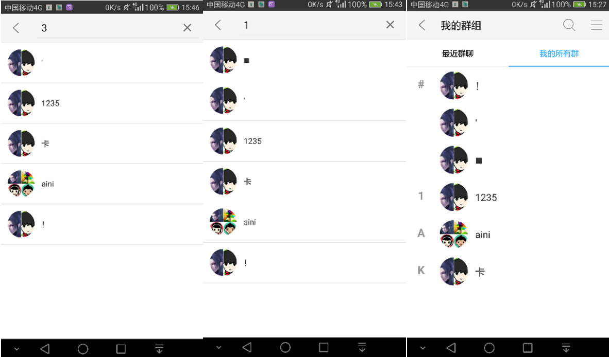
      AI的分析结果：在“我的群组”页面中，当用户尝试通过搜索框输入数字进行群组搜索时，系统返回了与输入数字不匹配的群组名称。例如，用户可能会输入“1235”，但系统返回的群组名称却与“1235”无关。这可能导致用户难以找到他们想要的群组，从而降低了用户体验。
   2. Id：10010000009233
      问题描述：卸载应用后，最近群聊和消息记录全部清空了，只可以在我的群组里查看到我的所有群。
      相应的图片：
      AI分析结果：在执行应用的卸载操作后，用户的最近群聊和消息记录被意外地清空了。此外，用户只能在我的群组里查看到他们之前加入的所有群聊，而无法访问任何具体的聊天内容或历史消息。这可能表明在应用的卸载过程中，相关的数据存储和检索功能出现了问题。

   可以看出：AI模型融合了图片和文字，重新对问题做出了描述，实现了图文融合。

   图文融合后的数据路径："1.GraphAndTextFusion\\**afterFusion.xlsx**"

### 1.2 去除停用词和清除垃圾数据

我们结合数据大体特征以及通用的停用词列表制定了一份适合的停用词列表用来清除潜在的干扰词/无用词，并使用jieba库实现分词，对于分词后词组数少于5的报告认定为垃圾数据并清除。在第一次分词后我们进行了词频统计，将出现次数过多的词组认定为报告共有的词组并将其加入停用词列表，进行第二次预处理。

预处理数据路径："2.Preprocessing\\**afterPreprocessed.xlsx**"

词频统计数据路径："2.Preprocessing\\**WF_afterPreprocessed.xlsx**"

## 2. 特征提取

### 2.a Sentence-Bert特征提取法

1. **思路**：利用huggingface提供的接口，使用sentence-bert的方法将中文的语句提取特征，转化为向量，用于后续的聚类分析。
2. **提取向量**：使用**bert-base-chinese模型**，利用huggingface的接口对图文融合的问题描述提取语句向量。
   1. 遇到的问题：由于样本集数据量过大（1400+条）的数据，且模型计算花费时间较长，资源开销大。
   2. 解决方法：我们将图文融合的数据分五次分别进行特征提取，将向量依次存储。在后续使用时再读取。解决了性能问题，同时避免重复计算，浪费资源。
   3. 向量文件路径： "3.a.SentenceBert\\**embeddings*.npy**"
3. **向量的降维**：由于模型计算出来的向量过大（shape 为1400 * 128 * 768）的三维向量，此处先对其降维。考虑PCA降维方法与T-SNE方法。由于向量太大，T-SNE方法效率低。故采用**PCA降维**方法，将向量降为2维，用于后续聚类分析以及散点图绘制。

### 2.b TF-IDF矩阵

1. **思路**：利用去除停用词和jieba分词的数据生成TF-IDF向量并构建TF-IDF矩阵，用于后续的聚类分析。TF-IDF向量是基于词频构建的，能有效反映数据的内容和特征。
2. **生成TF-IDF向量**：
   1. 遇到的问题：①大模型的回答模板中会重复提及回答模板用词（例如：“用户”，“功能”），会提高向量的相似度，模糊了聚类。②数据量过大，词语次数过多，导致TF-IDF向量维度溢出，不利于聚类分析。
   2. 解决方法：①二次处理：预处理阶段的词频统计对词语进行分析与筛选，重新确定停用词，再次清洗数据。②筛选高频词语：根据词频统计结果，筛选出词频大于统计标准的词语，将其作为TF-IDF向量的维度。
3. **构建TF-IDF矩阵**：对于筛选出的高频词语，生成TF-IDF向量，将所有文档的TF-IDF向量组合起来，构建一个TF-IDF矩阵
   文件路径："3.b.TF-IDF\TFIDFMatrix10.xlsx"

## 3. 聚类分析及结果

### 3.a Sentence-Bert特征提取法的聚类及其结果分析

1. **聚类分析**：采用K-means聚类方法：使用语句向量作为输入，通过多次尝试确定适合的聚类数，执行K-means聚类算法。并将聚类结果分类存储在excel之中。

2. **聚类散点图绘制**：以14聚类数为例，不同的点代表不同样本，颜色相同代表同一个类别
   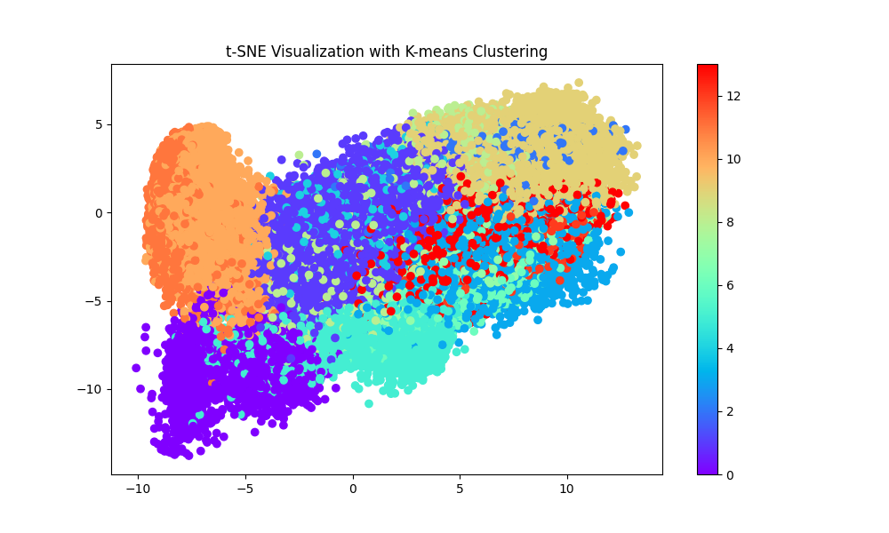

3. 采取两种方法对聚类结果进行考察分析

   1. **主题词提取**：对不同聚类进行词频统计，将频数最高的定义为该聚类的主题词，之后可生成词云进行问题分析。
   2. **大模型分析**：通过把聚类后的报告使用智谱清言GLM4大模型分析，找出关键问题，为报告撰写提供材料。

4.  **结果展示实例**：以14聚类数的结果为例，Excel表格中存储该类别对应的信息以及词频结果，Markdown文本中存储大模型分析的结果
   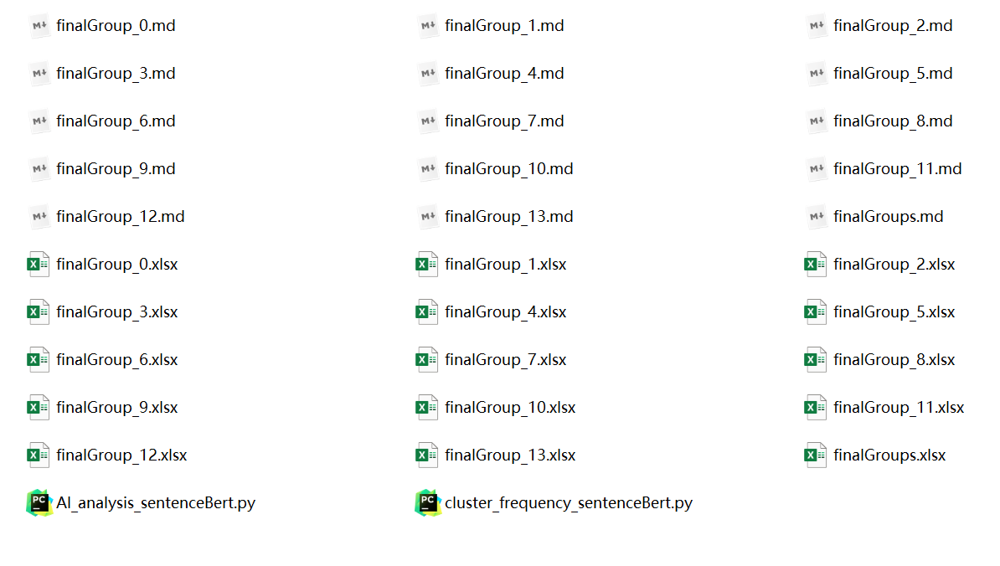

   1. 从**词频结果**来看，每一个类别都有着许多相同的大量出现的词语，对直接识别该类的特征造成一定的障碍。以14聚类数为例，选取三个类的词频统计情况。可以看出，类似“群组”，“群”，“系统”之类的词语大量的出现。说明这些词语并不是这些类区分的关键要素。但他们可能最终影响到了聚类的结果。
      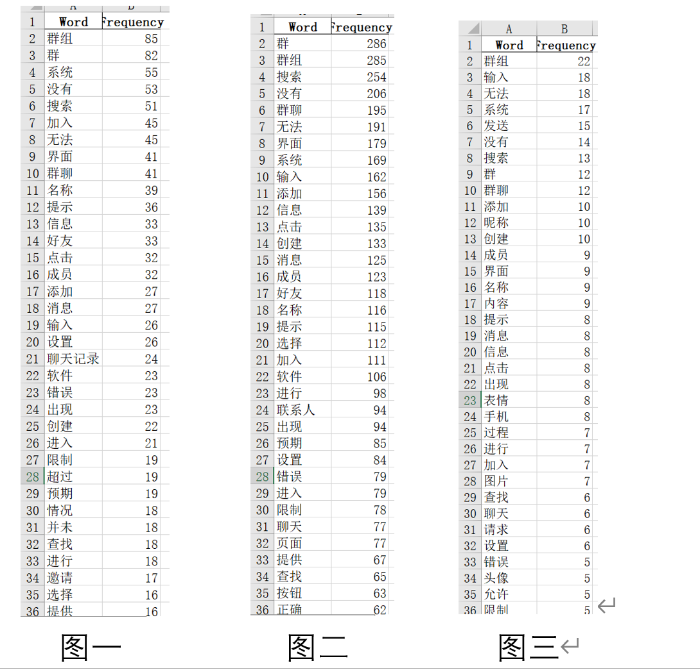

      **改进思路**：可以在数据预处理/图文融合后对结果进一步处理，去除如“群组”，“群”，“系统”之类的词语，使得不同问题的区别更加突出。要提取每个类别的特征需要从排名15或20+的词语中提取。如图一、二、三的核心词分别为：聊天记录、联系人、表情/图片。这些核心词可能才是对应类别的特征。虽然最终得到的结果并不十分突出显著，但从这些核心词来看，该方法在一定程度上可以对大量的图文信息做出一定的分类。

   2. 从**AI分析**结果来看，以14聚类数为例，选取三个类的分析情况，可以看出AI模型分析在一定水平上可以体现出类的不同之处。但效果不佳。原因如下：①同属一类的问题文本量较大，AI处理概括的能力也有限。②如词频分析所属，许多问题在描述方面存在许多公用的词语，AI概括中也会大量出现此类词语，并不能体现出核心词。难以反映类的特征。
   
      
      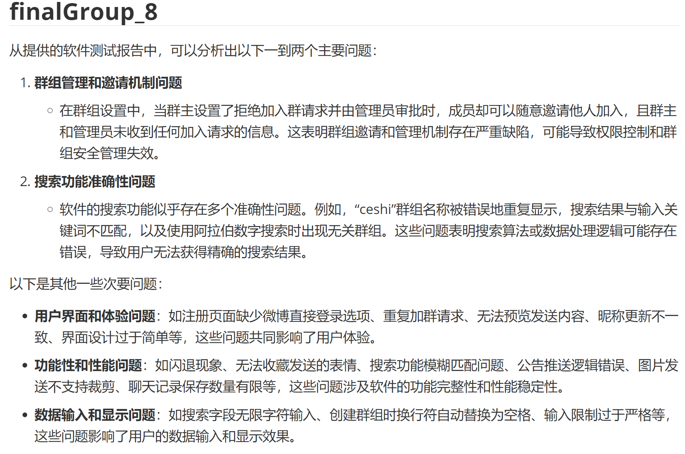
      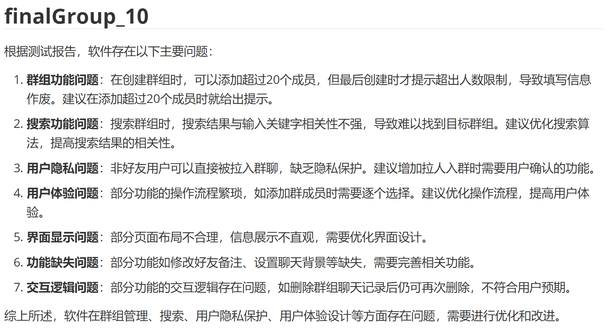

### 3.b TF-IDF矩阵的聚类及其结果分析

1. **执行K-means聚类**：使用TF-IDF矩阵作为输入，执行K-means聚类算法。

2. **确定最佳聚类数**：选择具有最高轮廓系数的聚类数，重新执行K-means聚类将报告分为若干个聚类。（最佳聚类数为14）

3. **PCA降维**：使用PCA降维到2维，绘制出所有聚类的散点图，以展示它们在特征空间中的分布。
   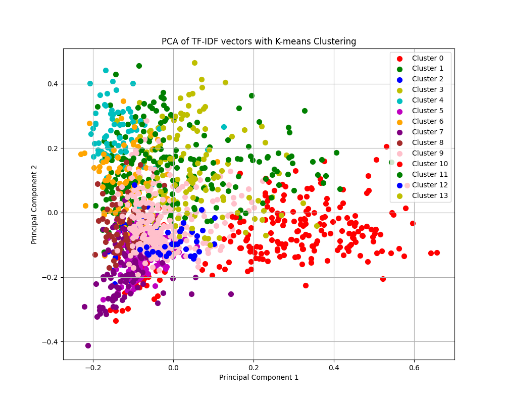
   
4. 采取两种方法对聚类结果进行考察分析

   1. **主题词提取**：对不同聚类进行词频统计，将频数最高的定义为该聚类的主题词，之后可生成词云进行问题分析。
   2. **大模型分析**：通过把聚类后的报告使用智谱清言GLM4大模型分析，找出关键问题，为报告撰写提供材料。

5. **结果展示实例**：Excel表格中存储该类别对应的信息以及词频结果，Markdown文本中存储大模型分析的结果。
   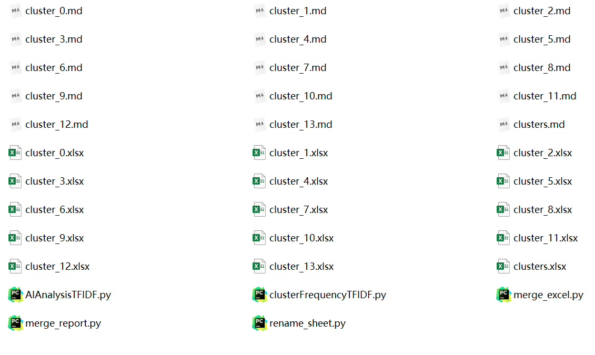

   1. 从**词频统计**结果来看，每个聚类的词频统计中都有1~2个频数较为突出的词，我们可以将其视作该聚类的主题词并推测该聚类集中体现的软件问题。比如图中第一个统计反映了聊天记录删除和清空功能可能存在缺陷，第二个统计反映了软件在添加好友模块可能存在缺陷，第三个统计反映了软件在搜索功能上可能存在缺陷。但词频统计也会记录不同聚类的共有词（例如“群聊”），可能会影响聚类结果和问题判断，这说明需要在二次处理阶段对共有词进行去除。总的来说，该方法可以在一定程度上对大量的图文信息进行主题词标注并分类。
      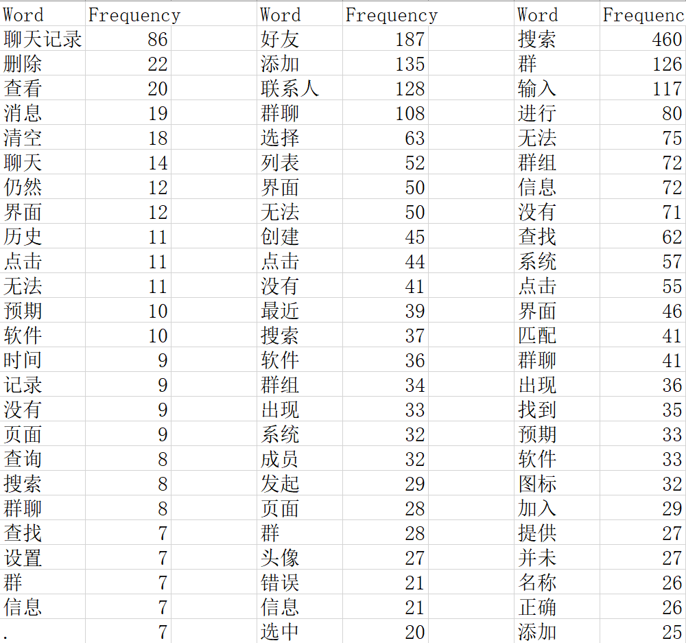

   2. 从**AI分析**结果来看，AI在一方面对特定的聚类报告总结提炼出软件集中体现的问题，展示聚类的特征，另一方面面对文本量较大的报告或受限于自身概括能力时，AI的分析便显得过于分散无法突出重点。但从总体上看AI对各个聚类的分析依然能在一定程度上反映了聚类的特征与软件的问题，说明该方法可以实现对图文信息的分类与信息提炼。
      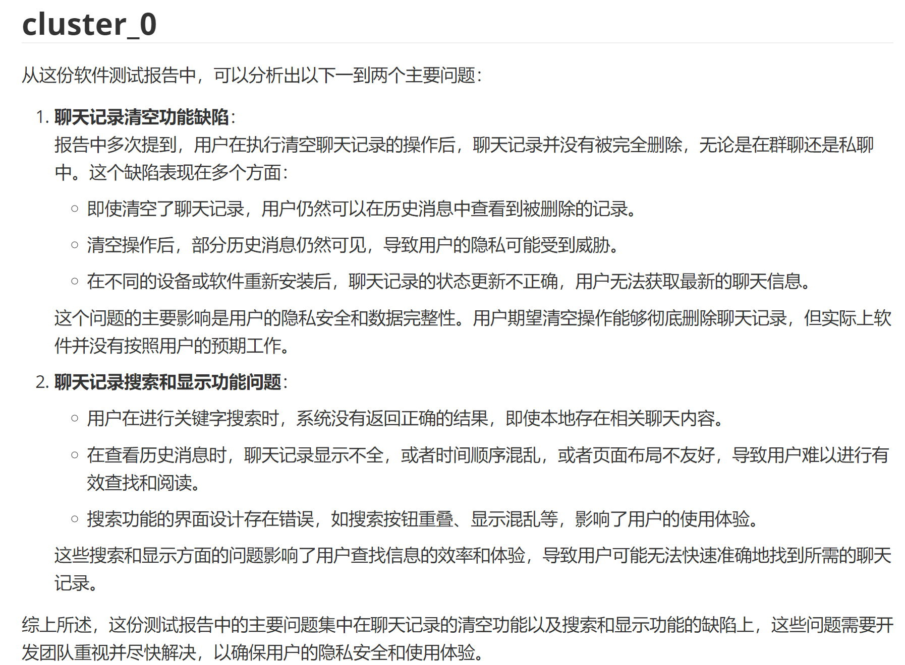
      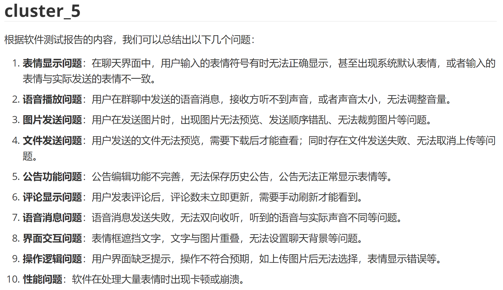

## 4.结论

*两种方法的对比*

*得出哪一种的分类结果更清晰*

oly：我感觉tfidf矩阵中主题词更突出，所以聚类效果更好？